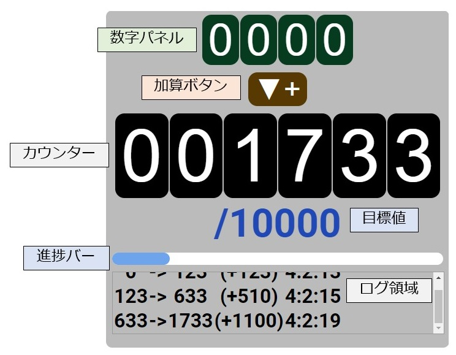

## これは何？
- 配信の耐久企画などに使える加算機能つきカウンター (click_counter.html)

## 操作部名称


## 基本の使い方

1. 上の数字パネル（緑色）に値を入力する。
各桁のパネルについて、左クリックで+1, 右クリックで-1できる。

2. 「▼+」（茶色）の加算ボタンを押すと、カウンター（黒色）に数字パネルの値が加算される。


## 応用

- カウンターは、直接各桁のパネルをクリック操作することで+1, -1することもできる。

- 上の数字パネル・下のカウンターそれぞれの桁数、および目標値 （「/」以降の青色の値）は、click_counter.htmlの以下の箇所から直接修正できる。

```
.clickcounter{

    （中略）

    /* ▼ 数字パネル（加算していく値）の桁数 ▼ */
    --digits_sub: 4;
    /* ▼ カウンター（集計していく値）の桁数 ▼ */
    --digits_main: 6;
    /* ▼ 目標値 ▼ */
    --goal: 10000;
}

```

## その他の機能

- カウンターの値が目標値まであとどれくらいかが、進捗バーに表示される。

- 「▼+」の加算ボタンを押した時の値の変化は、最下部のログ領域に出力される。
